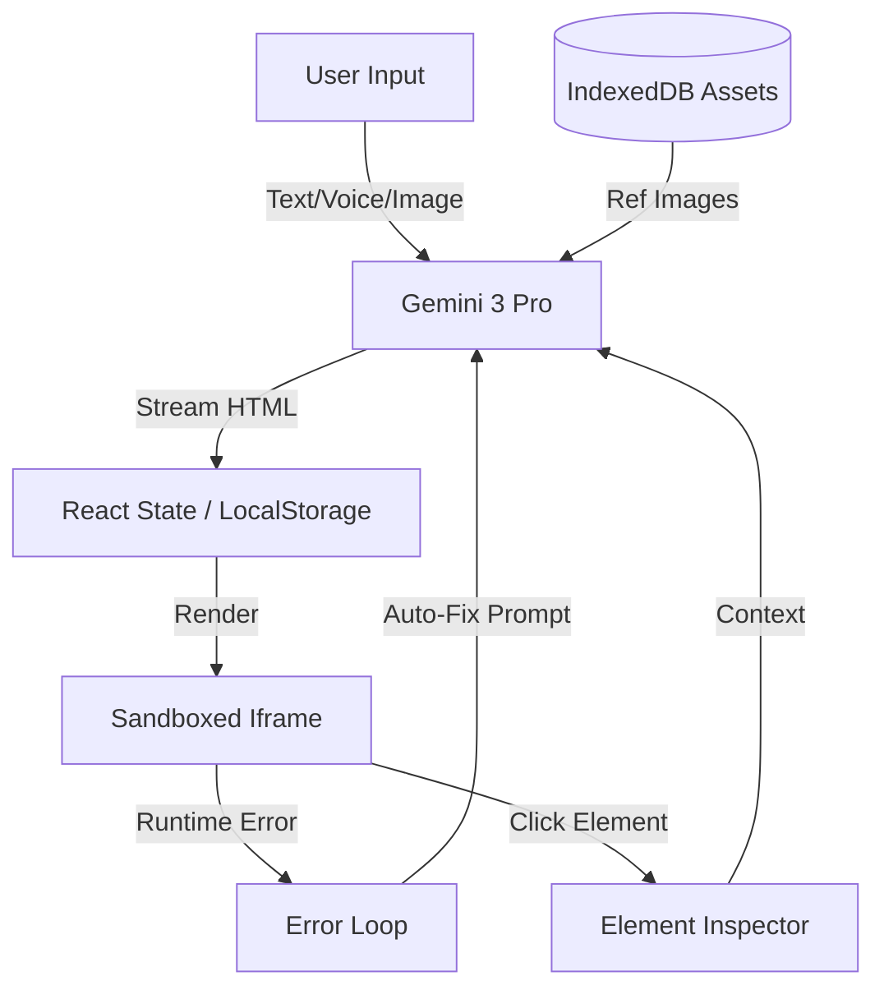

# DashGen Architecture

## High-Level Data Flow

## Module Breakdown

### 1. View Layer (`/components`)
*   **Stage**: The main area displaying `ArtifactCard`s. Handles responsive grid and focus modes.
*   **Drawers**: Slide-out panels for `History`, `Settings`, `Assets`, and `CodeEditor`.
*   **Overlays**: `AuroraBackground` and `NoiseOverlay` for aesthetic polish.

### 2. Logic Layer (`/hooks`, `/utils`)
*   **useHistory**: Custom hook implementing a temporal stack (Past/Present/Future) for robust Undo/Redo.
*   **aiHelpers**: Factory functions that construct complex multimodal prompts. It abstracts the "Persona" logic (e.g., switching between "Designer" and "Engineer" modes).
*   **storage / assetStore**: Abstraction layers for browser storage APIs.

### 3. Execution Environment (Iframe)
The generated code runs inside a secure boundary.
*   **Injected Scripts**: We inject a small runtime harness into every generated artifact.
    *   `window.onerror` capture -> `postMessage` to parent.
    *   `mouseover`/`click` interception for Inspector Mode.
*   **External Dependencies**: The artifacts rely on public CDNs (Tailwind, Chart.js) to function without a bundler.

## Key Design Decisions

*   **No Bundler Required**: The app uses native ES Modules (`import ... from 'https://esm.sh/...'`). This allows it to run in "zero-setup" environments like standard static file servers or AI Studio web containers.
*   **Prompt-as-Code**: We don't just ask the AI to "fix it". We construct detailed system prompts that define a specific "Persona" for each task (Accessibility, Refactoring, etc.), drastically improving output quality.
*   **Local-First**: No backend database. Your sessions live in your browser. This ensures privacy and zero latency, though it requires manual export for backup.
